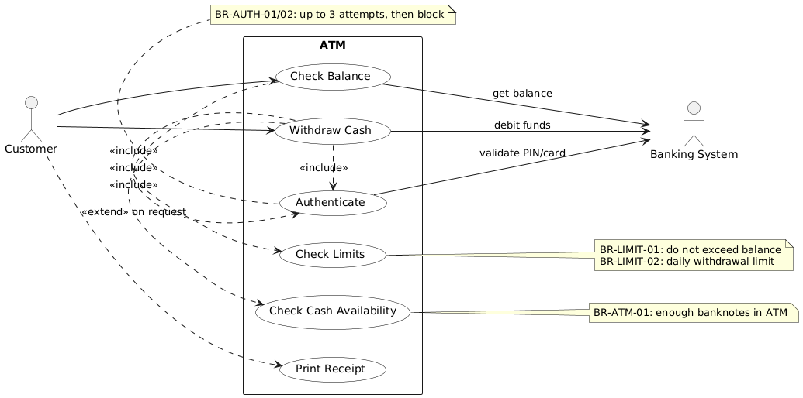
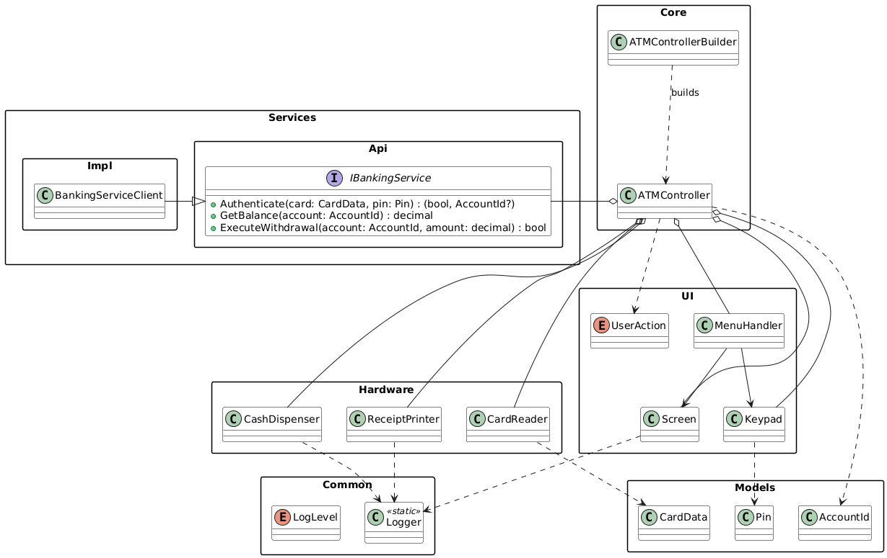

# Отчет по практической работе №1
## Модельно-ориентированный подход к проектированию

## Краткое описание
Разработана информационная система банкомата (ATM) с применением UML-диаграмм и принципов Domain-Driven Design (DDD). Реализованы как базовые функции (снятие наличных, проверка баланса), так и расширенные (смена PIN, внесение наличных, перевод средств, обслуживание).

## Архитектура проекта

Проект организован по принципу **Bounded Contexts** (Ограниченных контекстов):

### Структура папок
```
app/
├── Contexts/
│   ├── Hardware/         # Контекст оборудования
│   │   ├── CardReader.cs
│   │   ├── CashDispenser.cs
│   │   ├── CashAcceptor.cs
│   │   └── ReceiptPrinter.cs
│   ├── Banking/          # Контекст банковских операций
│   │   ├── Api/
│   │   │   └── IBankingService.cs
│   │   └── Impl/
│   │       └── BankingServiceClient.cs
│   ├── Operation/        # Контекст клиентских операций
│   │   ├── Controller.cs
│   │   └── ControllerBuilder.cs
│   └── Maintenance/      # Контекст обслуживания
│       └── MaintenanceController.cs
└── Kernel/               # Общие компоненты
    ├── Common/
    │   └── Logger.cs
    ├── Models/
    │   └── BankTypes.cs
    └── UI/
        ├── Screen.cs
        ├── Keypad.cs
        ├── MenuHandler.cs
        └── UserAction.cs
```

## Реализованные прецеденты

### Клиентские операции
1. **Проверка баланса** (`check_balance`)
   - Запрос текущего остатка на счете
   - Опциональная печать чека

2. **Снятие наличных** (`take_maney`)
   - Проверка баланса и лимитов
   - Проверка наличности в банкомате
   - Выдача наличных
   - Опциональная печать чека

3. **Смена PIN** (`change_pin`) ⭐ NEW
   - Ввод нового PIN дважды для подтверждения
   - Проверка совпадения
   - Обновление в банковской системе

4. **Внесение наличных** (`deposit_cash`) ⭐ NEW
   - Прием купюр через купюроприемник
   - Распознавание номинала и суммы
   - Подтверждение клиентом
   - Зачисление на счет

5. **Перевод средств** (`transfer_funds`) ⭐ NEW
   - Ввод номера карты получателя
   - Ввод суммы перевода
   - Проверка баланса
   - Подтверждение и выполнение

### Обслуживание (Maintenance)
6. **Техническое обслуживание и инкассация** (`maintenance`) ⭐ NEW
   - Аутентификация по сервисному коду
   - Пополнение диспенсера наличными
   - Инкассация купюроприемника
   - Проверка состояния устройств

## Диаграммы UML

### Диаграмма вариантов использования


Включает:
- **Актеры**: Клиент, Банковская система, Техник/Инкассатор
- **Базовые прецеденты**: Authentication, Check Balance, Withdraw Cash, Print Receipt
- **Дополнительные прецеденты**: Change PIN, Deposit Cash, Transfer Funds
- **Обслуживание**: Technical Maintenance
- **Вспомогательные**: Check Limits, Check Cash Availability

### Диаграмма классов


Отражает:
- **Пакеты**: Hardware, Banking, Operation, Maintenance, Kernel (Common, Models, UI)
- **Основные классы**: ATMController, MaintenanceController, BankingServiceClient
- **Оборудование**: CardReader, CashDispenser, CashAcceptor, ReceiptPrinter
- **Отношения**: Aggregation (o-), Dependency (..), Generalization (-|>)

### Диаграммы последовательности
1. **Проверка баланса** (`diagram/seq_check_balance.png`)
2. **Снятие наличных** (`diagram/seq_withdraw_cash.png`)

## Соответствие бизнес-правилам

| Код правила | Описание | Реализация |
|------------|----------|------------|
| BR-AUTH-01/02 | Лимит 3 попытки PIN, блокировка | `ATMController.ProcessClientSession()` |
| BR-LIMIT-01 | Проверка баланса | `BankingServiceClient.ExecuteWithdrawal()` |
| BR-LIMIT-02 | Суточный лимит снятия | `BankingServiceClient._dailyWithdrawals` |
| BR-ATM-01 | Проверка наличности в банкомате | `CashDispenser.CanDispense()` |
| BR-SESSION-01 | Таймаут 60 секунд | `Keypad.GetInput(TimeSpan)` |
| BR-DEPOSIT-01-03 | Правила внесения наличных | `CashAcceptor.AcceptCash()` |
| BR-TRANSFER-01-03 | Правила перевода средств | `BankingServiceClient.Transfer()` |
| BR-MAINTENANCE-01-04 | Правила обслуживания | `MaintenanceController` |

## Особенности реализации

### 1. DDD подход
Применен подход Domain-Driven Design с разделением на Bounded Contexts:
- **Hardware Context**: Управление физическим оборудованием
- **Banking Context**: Интеграция с банковской системой
- **Operation Context**: Бизнес-логика клиентских операций
- **Maintenance Context**: Логика обслуживания и инкассации
- **Kernel**: Общие компоненты (Value Objects, UI, Logging)

### 2. Builder Pattern
Использован паттерн Builder для конструирования `ATMController` с валидацией зависимостей через рефлексию.

### 3. Dependency Injection
Все зависимости передаются через конструктор, обеспечивая слабую связанность и тестируемость.

### 4. Расширяемость
Новые способы оплаты, устройства или операции могут быть добавлены без изменения существующего кода благодаря использованию интерфейсов.

## Как запустить

### Компиляция
```powershell
dotnet build app\ATM.csproj
```

### Запуск
```powershell
dotnet run --project app\ATM.csproj
```

### Режим обслуживания
Для доступа к функциям инкассатора используйте сервисный код: **9999**

## Контрольные вопросы

**1. Что такое UML? Какие вы знаете основные диаграммы UML?**

UML (Unified Modeling Language) — это унифицированный язык моделирования для визуализации, спецификации, конструирования и документирования артефактов программных систем.

Основные диаграммы UML:
- **Структурные**:
  - Диаграмма классов (Class Diagram)
  - Диаграмма компонентов (Component Diagram)
  - Диаграмма развертывания (Deployment Diagram)
  - Диаграмма объектов (Object Diagram)
  - Диаграмма пакетов (Package Diagram)

- **Поведенческие**:
  - Диаграмма вариантов использования (Use Case Diagram)
  - Диаграмма последовательности (Sequence Diagram)
  - Диаграмма деятельности (Activity Diagram)
  - Диаграмма состояний (State Machine Diagram)
  - Диаграмма коммуникаций (Communication Diagram)

**2. Какие элементы входят в состав диаграммы классов?**

Диаграмма классов состоит из:

**Основные элементы:**
- **Классы**: Прямоугольники с тремя секциями (имя, атрибуты, операции)
- **Интерфейсы**: Классы со стереотипом `<<interface>>`
- **Абстрактные классы**: Имя класса выделено курсивом

**Отношения:**
- **Ассоциация (Association)**: Сплошная линия (связь между классами)
- **Агрегация (Aggregation)**: Линия с пустым ромбом (отношение "целое-часть", слабая связь)
- **Композиция (Composition)**: Линия с закрашенным ромбом (отношение "целое-часть", сильная связь)
- **Обобщение/Наследование (Generalization)**: Линия с незакрашенной стрелкой (иерархия классов)
- **Реализация (Realization)**: Пунктирная линия с незакрашенной стрелкой (реализация интерфейса)
- **Зависимость (Dependency)**: Пунктирная линия со стрелкой (один класс использует другой)

**Дополнительные элементы:**
- **Пакеты**: Группировка классов
- **Перечисления (Enums)**: Специальные типы
- **Стереотипы**: Метки вида `<<stereotype>>`
- **Видимость**: `+` public, `-` private, `#` protected, `~` package
- **Множественность**: Указание количества связанных объектов (1, 0..1, 1..*, *)

## Выводы

В ходе работы:
1. Освоена разработка UML-диаграмм для проектирования информационных систем
2. Применен модельно-ориентированный подход с использованием DDD
3. Реализовано 6 прецедентов с полной поддержкой бизнес-правил
4. Создана расширяемая архитектура с разделением на контексты
5. Подготовлена полная документация по каждому прецеденту

Система готова к расширению дополнительными функциями и интеграции с реальными банковскими системами.
