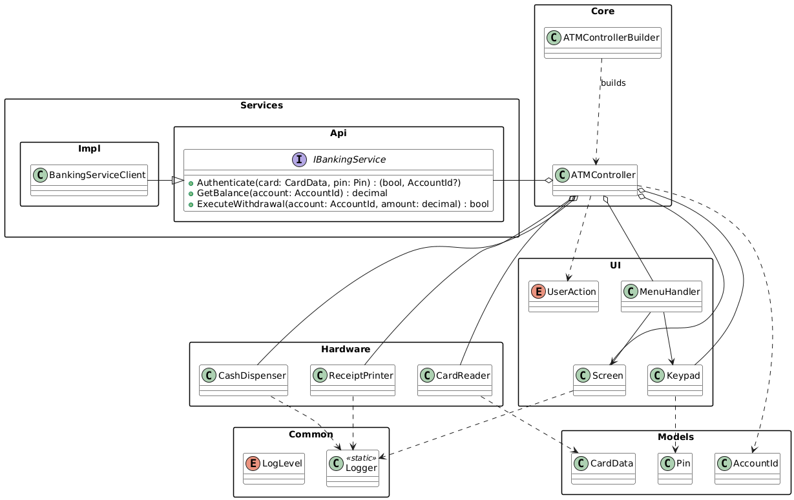

# Отчет по практической работе

## Диаграммы

- Диаграмма вариантов использования: 
- Диаграмма классов: 
- Диаграмма последовательности — Проверка баланса: 
- Диаграмма последовательности — Снятие наличных: 

## Соответствие бизнес-правилам

- BR-AUTH-01/02: Лимит 3 попытки PIN и блокировка — реализовано в `ATMController` (циклический ввод PIN с таймаутом, прекращение после 3 ошибок).
- BR-LIMIT-01/02: Проверка баланса и суточного лимита — реализовано в `BankingServiceClient` при `ExecuteWithdrawal`.
- BR-ATM-01: Проверка остатка наличности банкомата — реализовано в `CashDispenser.CanDispense/TryDispense` и используется в `ATMController` перед списанием.
- BR-SESSION-01: Таймаут 60 секунд — реализован в `Keypad.GetInput(TimeSpan)/GetPinInput(TimeSpan)` и используется контроллером.
- Печать чека — реализована в `ATMController` через `ReceiptPrinter` по запросу клиента.

## Прецеденты

- Спецификация «Запрос баланса»: `Прецеденты/Запрос баланса/x.md`
- Спецификация «Снятие наличных»: `Прецеденты/Снятие наличных/y.md`

## Как запустить

```powershell
.\.dotnet\dotnet build "Приложение\ATM.csproj"
.\.dotnet\dotnet run --project "Приложение\ATM.csproj"
```
